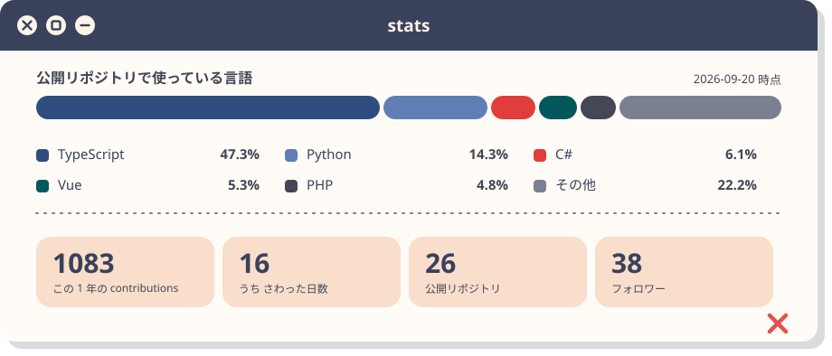

<div align="center">

<picture>
  <source media="(prefers-color-scheme: dark)" srcset="assets/header-dark.svg">
  
</picture>

<p>
  <a href="https://www.riml.work"><picture><source media="(prefers-color-scheme: dark)" srcset="assets/badge-portfolio-dark.svg"></picture></a>
  <a href="https://x.com/fande4d"><picture><source media="(prefers-color-scheme: dark)" srcset="assets/badge-x-dark.svg"></picture></a>
  <a href="https://lapras.com/public/Riml"><picture><source media="(prefers-color-scheme: dark)" srcset="assets/badge-lapras-dark.svg"></picture></a>
  <a href="https://github.com/RimlTempest/riml-ds"><picture><source media="(prefers-color-scheme: dark)" srcset="assets/badge-ds-dark.svg"></picture></a>
</p>

</div>

## ✕ こんにちは

フロントエンドが好きなエンジニアです！
本業では組織改善をしたり、インフラからフロントまでフルスタックにコミットしたりしながらデザインシステム作ったりしてます！
個人でも作ってみたり？ [**riml-ds**](https://github.com/RimlTempest/riml-ds) このプロフィールもデザインシステムを通してます。

つくったものは [リポジトリ一覧](https://github.com/RimlTempest?tab=repositories) に置いてあります。

## ✕ 道具箱 <sub><sup>toolbox</sup></sub>

<div align="center">
  <picture>
    <source media="(prefers-color-scheme: dark)" srcset="assets/toolbox-dark.svg">
    
  </picture>
</div>

## ✕ すうじ

<div align="center">
  <picture>
    <source media="(prefers-color-scheme: dark)" srcset="assets/stats-dark.svg">
    
  </picture>
</div>

絵の中の文字は [`content.toml`](content.toml) にあります。書き換えたら作り直してください。

```sh
bun run scripts/build.ts --offline  # content.toml の文字だけ反映して assets/*.svg を生成
bun run scripts/build.ts            # 数字も GitHub の公開 API から取り直す
```

<div align="center">

<picture>
  <source media="(prefers-color-scheme: dark)" srcset="assets/footer-dark.svg">
  
</picture>

</div>
