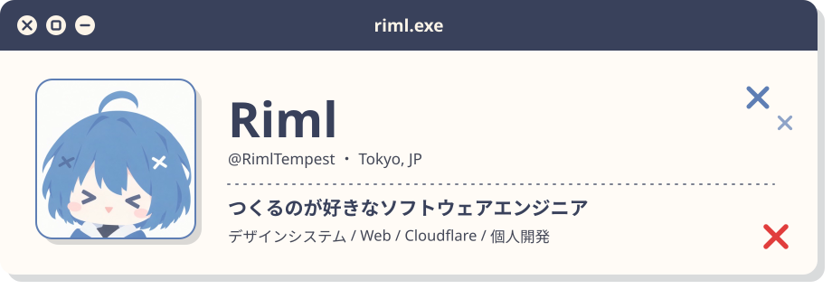
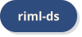
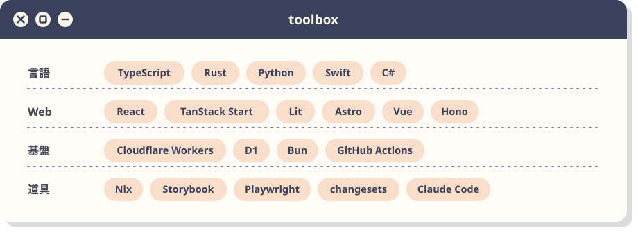
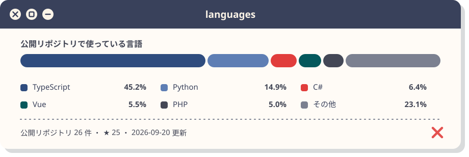
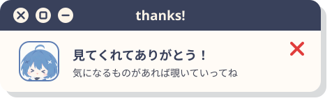

<div align="center">

<picture>
  <source media="(prefers-color-scheme: dark)" srcset="assets/header-dark.svg">
  
</picture>

<p>
  <a href="https://www.riml.work"><picture><source media="(prefers-color-scheme: dark)" srcset="assets/badge-portfolio-dark.svg"></picture></a>
  <a href="https://x.com/fande4d"><picture><source media="(prefers-color-scheme: dark)" srcset="assets/badge-x-dark.svg"></picture></a>
  <a href="https://lapras.com/public/Riml"><picture><source media="(prefers-color-scheme: dark)" srcset="assets/badge-lapras-dark.svg"></picture></a>
  <a href="https://github.com/RimlTempest/riml-ds"><picture><source media="(prefers-color-scheme: dark)" srcset="assets/badge-ds-dark.svg"></picture></a>
</p>

</div>

## ✕ つくっているもの <sub><sup>what I'm building</sup></sub>

| 窓 | なにを | つかっているもの |
| --- | --- | --- |
| [**riml-ds**](https://github.com/RimlTempest/riml-ds) | 自分のプロダクト群が共有するデザインシステム。DTCG トークンから Lit の部品、各フレームワークのラッパー、AI エージェント向けの MCP まで一式 | TypeScript / Lit / Storybook |
| [**qrcc2**](https://github.com/RimlTempest/qrcc2) | QR・バーコードの生成 / 読み取り / 管理 / 印刷ツール | TanStack Start / Rust / Cloudflare Workers |
| [**noter2**](https://github.com/RimlTempest/noter2) | 複数人でリアルタイムに編集する markdown / yaml / toml / json エディタ | TypeScript / Cloudflare Workers |
| [**subculture-event-db**](https://github.com/RimlTempest/subculture-event-db) | 東京のアニメ・コスプレ・同人・VTuber・展示会イベントを横断で集めるデータベース | TypeScript / Bun |
| [**Riml-Chan-Bot**](https://github.com/RimlTempest/Riml-Chan-Bot) | イベントの締切を教えてくれる Discord bot | TypeScript |

ほかにも Live2D まわりの実験や、macOS の環境を丸ごと持ち歩くための [dotfiles](https://github.com/RimlTempest/dotfiles)（Nix + home-manager）を置いています。

## ✕ 道具箱 <sub><sup>toolbox</sup></sub>

<div align="center">
  <picture>
    <source media="(prefers-color-scheme: dark)" srcset="assets/toolbox-dark.svg">
    
  </picture>
</div>

## ✕ 言語 <sub><sup>languages</sup></sub>

<div align="center">
  <picture>
    <source media="(prefers-color-scheme: dark)" srcset="assets/languages-dark.svg">
    
  </picture>
</div>

## ✕ うごき <sub><sup>activity</sup></sub>

<div align="center">
  <a href="https://www.riml.work">
    
  </a>
</div>

## ✕ この窓について <sub><sup>about this profile</sup></sub>

画像はぜんぶ [riml-ds](https://github.com/RimlTempest/riml-ds) の視覚言語「まど」（帯 + 丸 3 つ + ピル + 硬い影 + 点線、クリームの紙とインク、髪の青と目の赤）で描いていて、`scripts/build.ts` が毎日つくり直しています。

```sh
bun run scripts/build.ts            # 言語の割合を取り直して assets/*.svg を生成
bun run scripts/build.ts --offline  # 前回取った値のまま作り直す
```

<div align="center">

<picture>
  <source media="(prefers-color-scheme: dark)" srcset="assets/footer-dark.svg">
  
</picture>

</div>
